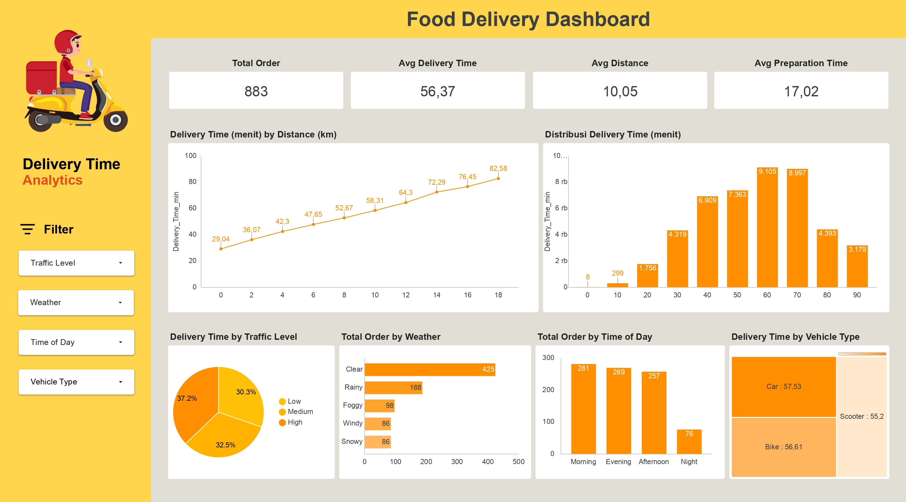

# 🛵 Food Delivery Time Prediction
Optimize Food Delivery: Predict Times with Real-World Data

## Business Understanding
Dalam industri food delivery, estimasi waktu pengantaran yang akurat sangat penting untuk meningkatkan kepuasan pelanggan dan efisiensi operasional.

Namun, sering terjadi:
- Estimasi waktu tidak akurat
- Keterlambatan pengiriman
- Kurangnya sistem prediksi berbasis data
Oleh karena itu, diperlukan solusi berbasis Machine Learning untuk memprediksi waktu delivery secara lebih presisi.

### Permasalahan Bisnis
Permasalahan utama yang dihadapi adalah:

* Ketidakakuratan estimasi waktu pengiriman
* Sulitnya memperhitungkan faktor eksternal (cuaca, traffic, dll)
* Tidak adanya sistem prediksi otomatis
* Inefisiensi operasional dalam proses delivery

### Cakupan Proyek
Proyek ini berfokus pada pengembangan sistem berbasis data untuk memprediksi durasi waktu pengiriman. Cakupan proyek meliputi:

* Melakukan eksplorasi dan pemahaman data (data understanding)
* Melakukan data preprocessing dan feature engineering
* Mengembangkan model machine learning untuk prediksi waktu delivery
* Mengevaluasi performa model menggunakan metrik yang relevan
* Membangun dashboard interaktif untuk analisis dan monitoring
* Mengembangkan prototype sistem prediksi berbasis web menggunakan Streamlit

### Persiapan

Sumber data: [Lihat Dataset](https://www.kaggle.com/datasets/denkuznetz/food-delivery-time-prediction/data)

Setup environment:

- Buat Virtual environment
```
python3 -m venv env
```
- Jalankan virtual environment
```
source venv/bin/activate   # Mac/Linux
venv\Scripts\activate      # Windows
```
- Install library yang dipakai
```
pip install -r requirements.txt
```

## Business Dashboard
Dashboard yang dikembangkan bertujuan untuk membantu analisis performa sistem food delivery secara visual dan interaktif. Dashboard ini menyajikan berbagai metrik utama dan visualisasi penting yang memudahkan dalam memahami faktor-faktor yang mempengaruhi waktu pengantaran.

Dashboard ini membantu perusahaan dalam:

* Mengidentifikasi faktor utama yang mempengaruhi waktu delivery
* Menganalisis hubungan antara jarak dan waktu pengiriman
* Memahami dampak traffic dan cuaca terhadap keterlambatan
* Mengetahui pola order berdasarkan waktu (pagi, siang, sore, malam)
* Membandingkan performa kendaraan dalam pengiriman

Dashboard dapat diakses [disini](https://datastudio.google.com/reporting/8fca144d-a304-4dc9-baec-9bc8aad154f8)



## Menjalankan Sistem Machine Learning
Prototype sistem machine learning dikembangkan menggunakan Streamlit untuk memungkinkan pengguna melakukan prediksi waktu pengantaran makanan secara interaktif.

Sistem ini menerima input data pengiriman, seperti:

* 📍 Jarak tempuh (km)
* ⏱️ Waktu persiapan (menit)
* 👨‍🍳 Pengalaman kurir (tahun)
* 🚦 Tingkat kemacetan (Low, Medium, High)
* 🚗 Jenis kendaraan (Bike, Car, Scooter)
* 🌦️ Kondisi cuaca (Sunny, Rainy, dll)
* 🕒 Waktu pengiriman (Morning, Afternoon, Evening, Night)


Untuk menjalankan sistem machine learning prediksi delivery time ada 2 cara, bisa dilakukan secara online ataupun lokal.

**Menjalankan Prototype Secara Lokal**

1. Clone repository:
```
git clone https://github.com/ahmadaldiyanto/dropout-app.git
cd dropout-app
```
2. Aktifkan virtual environment:
```
source venv/bin/activate   # Mac/Linux
venv\Scripts\activate      # Windows
```
3. Install dependencies:
```
pip install -r requirements.txt
```
4. Jalankan aplikasi:
```
streamlit run app.py
```
5. Buka di browser:
```
http://localhost:8501
```

**Menjalankan Prototype Secara Online**

Untuk menjalankan prototype secara online, link bisa di akses di [sini](https://dropout-app-jaya-institute.streamlit.app/)
```
https://dropout-app-jaya-institute.streamlit.app/
```

## Conclusion
Berdasarkan hasil analisis dan pengembangan model machine learning, dapat disimpulkan bahwa:

* ⏱️ Waktu delivery sangat dipengaruhi oleh jarak tempuh
* 🚦 Tingkat kemacetan memiliki dampak signifikan terhadap keterlambatan
* 🌦️ Kondisi cuaca mempengaruhi performa pengiriman
* 🚗 Jenis kendaraan mempengaruhi kecepatan delivery
* 🕒 Waktu pengiriman (time of day) berpengaruh terhadap jumlah order dan waktu tempuh

Model yang dikembangkan mampu memberikan estimasi waktu delivery dengan cukup baik dan dapat digunakan sebagai alat bantu dalam pengambilan keputusan operasional.

### Rekomendasi Action Items
* Mengoptimalkan rute pengiriman berdasarkan jarak dan traffic
* Menyesuaikan jumlah kurir pada jam sibuk
* Mempertimbangkan kondisi cuaca dalam estimasi delivery
* Menggunakan kendaraan yang lebih efisien untuk jarak tertentu
* Mengintegrasikan sistem prediksi ke dalam aplikasi delivery